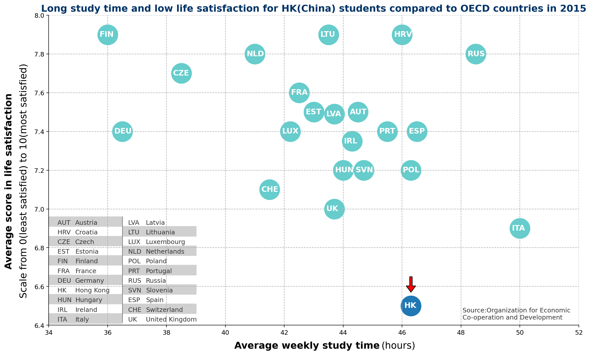

## Interactive Charts Make Data Clearer

### Members
- Huanzhang Shen(沈焕彰): 320190940411
- Shenglin Xu(许圣麟): 320190940621
- Zexi He(何泽熹): 320190939991     

### Abstract

Visualizing data is a task that we see everywhere in our daily lives. However, it is not easy to present the data properly to the readers. For websites or some modern media, the use of interactive charts may make visualization more efficient.
To introduce this, we have selected an information visualization from China Daily HK. It presents a particular phenomenon in Hong Kong education: high student engagement and low satisfaction with education.
We will analyze and modify this visualization to make it more in line with some good visualization guidelines. Most importantly, we will turn it into an efficient interactive chart.

### Original Source
https://www.chinadailyhk.com/articles/210/245/84/1532946794238.html
As presented in the abstract, the [article](https://www.chinadailyhk.com/articles/210/245/84/1532946794238.html) describes the direction of education reform in Hong Kong, and we were intrigued by a visualization depicting the length of study and life satisfaction of Hong Kong students. We wanted to use it as a starting point to carry our other works.

### Introduction of the Backstory and Basic Analysis
Hong Kong is a modern international metropolis. Its economy, culture and education are internationally renowned. However, the quality of students' study life in Hong Kong isn't as good as everyone generally believes. Because of the unique cultural background, parents in Hong Kong tend to generally want their children to be excellent learners and to excel in competition with others of their age.

As a result, many students have to face tremendous academic stress, and most parents do not have adequate and practical methods and knowledge to help their children relieve the stress. Despite their dedication to become a good student, Hong Kong students are not happy with their lives.

This visualization attempts to use a scatter plot to compare the learning engagement and life satisfaction of students in Hong Kong with the corresponding situation in other OCED countries. We think it would be very wise indeed to use information visualization here. The information visualization makes it easy for everyone to understand how the length of study and life satisfaction of students in each region compare. A clear and concise visualization would allow readers to quickly understand the magnitude of the plight faced by students in Hong Kong.

​                                                                                                     *The Chart from Original Source*  

You may think that this chart has basically accomplished its mission, but we still think that it could probably be better. In short, it is not efficient and has many distracting and confusing elements. However, before we talk about how to make it better, maybe we need to analyze how it is a chart.

### Details about the Original Chart

As we have mentioned repeatedly, this original visualization is from a news article on the China Daily Hong Kong website, and it shows the magnitude of the problem. While Hong Kong students devote more time to their studies than students in most of the regions in the data, they tend to reap lower life satisfaction.
Specifically, this chart shows the current situation of Students in Hong Kong and its comparison with students in other OECD (Which stands for Organization for Economic Cooperation and Development, is an international governmental organization with 38 member countries) countries using a scatter plot. 

We will first reproduce it using matplotlib and introduce you to the basic structure of this diagram.

##### The Structure of Original Chart

 

​                                                                                                        *The Replicated Chart*

As you can see, this chart is not simple, but quite easy to understand. It has the following basic structure:

- It has an x-axis representing the average number of hours students study per week and a y-axis representing students' life satisfaction. 
- The data for students in each region are aggregated into a value that corresponds to a specific point in the scatter plot after some average-like processing.
- In order to distinguish the data source of each data point, an abbreviation about the region is written in the data point. 
- The reader can consult the legend to find out the full name of the region corresponding to each abbreviation. 
- We can see that the points in the figure are divided into two parts by color, and there is a red arrow at the HK point. Readers can be attracted by these visual elements and quickly realize the focus of this picture. This allows readers to better understand what this picture is trying to express
- In a nutshell, the coordinate corresponding to each point can reflect the current study pressure and balance state of study life of students in the country or region to a certain extent.

##### Corresponding Analysis, and Background
According to the data points in the graph, we can clearly see that most of the regions are concentrated in the upper left corner of the graph. This means that students in other regions tend to have a higher level of life satisfaction for a shorter amount of study time. Even if students in individual regions such as Italy and Russia study longer, their life satisfaction is quite higher than in Hong Kong.

We regret to inform you that, many data show that this phenomenon is not only happening in Hong Kong. Students in Mainland China, Japan and other East Asian regions may be experiencing the same plight. How to promote the reform of education so that students can receive a happy and sound education is a major problem for them. In fact, this is exactly why we have chosen such a visualization to modify. It reveals a rather serious problem and, as a result, it takes on the greater responsibility of making it all clear to the reader.

Admittedly, we have to praise that this chart is very intuitive to readers, but obviously it can do better. Now, we will show you our approach.

### Improvements We Made

##### 1. Design a Better Labels

In the original figure, the label of the Y axis is rotated with many explanatory words. Obviously, this does not make users quickly understand what it means. 

​                                                                                                          *The Original Labels*

So we decided to simplify the label and put it above the Y axis. Users can quickly notice it. At the same time, we also added a further explanation of the y-axis label at the bottom of the figure.

​                                                                                                         *The Improved Labels*

##### 2. Use Contrast Color
Two colors are used in the original figure to distinguish the data: cyan and blue. However, their contrast is not obvious, which tends to confuse the reader about the different data points. White words on a lighter cyan background are also difficult to recognize. As a modification, we use the more contrasting dark blue and red, which are more eye-catching.

​																				Words on Different Colored Backgrounds

We believe that no matter how the visualization is done, when we need to reflect the contrast, we should use colors with larger distinctions whenever possible.

##### 3. Remove Redundant Elements

First, we remove the redundant grid, which we believe will only distract the reader's attention in this image.

Second, we remove the red arrow head attached to the data point "Hong Kong". The different colors are enough to allow the reader to distinguish the difference between the two kinds of datapoints. Extra elements would only make the graph inconsistent.

In a general sense, we believe that redundant elements should be removed whenever possible. They make the diagram full of various elements that are not necessarily important. In fact, the human brain cannot remember so many elements, and too many elements only make the reader lose interest in the visualization.

##### 4. Make the Chart Interactive

Most importantly, we have replaced the complex legends in the original charts with fun and interactive tip boxes. Actually, one of the main features of this visualization is its rather complex legend, which makes it difficult for the reader to understand the data in a straightforward way. If readers are curious about specific data for a particular region, they need to look up the corresponding data points through this complex legend. 

​																										*The Original Legends*

However, we thought that the graph is primarily intended to give the reader an idea of how Hong Kong compares to some sample countries, rather than to allow the reader to find out what the student life satisfaction situation is like in the region they are interested in. That is, the reader is less likely to need to look for the full name from the abbreviation than to check what the full name corresponding to the abbreviation is. 

Actually, a website could use a more modern way of displaying charts to make it more convenient and easy for readers to understand the data. The combination of interactive technology and charts may can make charts more exciting and clear to understand. With interactivity, charts become more dynamic, users can click and move the cursor with more interesting animations. And, with the right settings, users can go from any node of the chart to the source of the data or to other charts.

​																				              *The Interactive Legends*

In general, interactive charts provide a more vivid experience to users than static charts. And this kind of visualization also offer the possibility to make it easier to distribute data points too densely/scattered by zooming in/out of the chart.

But we need to be reminded that when we use visualization techniques, we still need to be aware of the source of the charts. It is not wise to make interactive modifications to charts on traditional media because we cannot render html pages on a single sheet of paper.

### Final Look

Let's try to see the final chart, which becomes clear and simple, yet efficient. This is the beauty of visualization and the new breakthrough that interactive technology brings us.

<iframe 
height=550   
width=80% 
src="./improved_graph.html" 
allowfullscreen
</iframe>

### Conclusion

We are using data visualization all the time in our daily lives. In the case we have chosen, for example, an accurate and concise visualization is very necessary. After all, as members of the community, we have an obligation to let everyone know that a group of people are in such a difficult situation. On a personal note, we, a group of students, also see the value in making more people aware of the pressures students face.

That's why the use of appropriate visualizations to make data more clearly presentable is an important topic for us mappers to consider. If visualizations are drawn using inappropriate methods, as in some of the cases we have seen in this case, they can make it difficult for readers to read or lose interest in the story behind the data.

We believe that the right modifications can make visualizations more efficient, and also allows the story behind the visualization to be more accurately communicated to the reader. In this case, the main solution we used was to use interactive techniques to make the visualization more vivid and straightforward. Perhaps you will be as excited as we are when you first click on the data points on the graph.

Interaction techniques are amazing in that they can make the reader relate to seemingly "unchanging" data in a whole new way. As the personal use of electronic devices gradually become more and more, perhaps it will bring a radical new change to the visualization technology. But we have to warn you: interactive charts still have their limitations - without the right vehicle, making a chart interactive can be counterproductive.